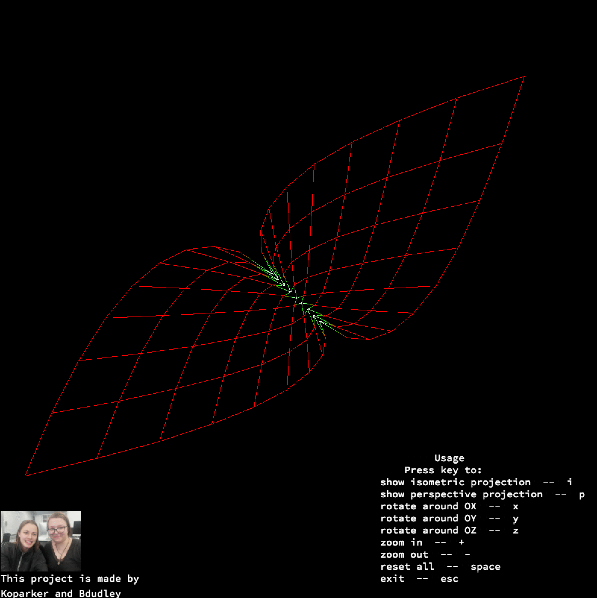

# FDF

## How to build

```
make
```

## How to run

```
./fdf maps/42.fdf
```
there are a lot of maps in **maps** and **tests** directories.

## How to view different features

The project has sevaral types of projection, zoom in/ zoom out modes, three types of rotation, reset it all feature and exit.
There are useful menu in the right bottom corner which was designed to help you navigate throught the project.


